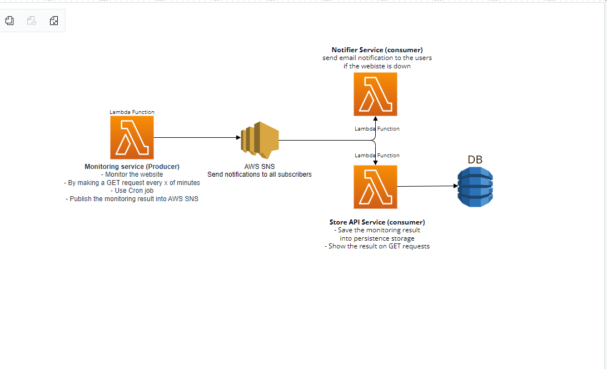

# Website monitoring services 
### As an Event Driven Architecture example
## Tech stack:
  Serverless, AWS Lambda (Nodejs, Javascript), AWS SNS.
> All services are independent, so you can spin up and test independently
> I use the [Serverless framework](https://www.serverless.com/) so you can follow the included readme file on each service to run it

### Monitoring service
- Monitoring website performance by making GET requests every x of minute
- Publish the monitoring result into AWS SNS

### Store API service
- Consume the monitoring results as an event
- Save it into persistence storage (for simplicity now we use json file to save just the last result/visit)
- Show the result on HTTP GET request

### Notifier service
- send email notification to the users if the webiste is down

This template does not include any kind of persistence (database). For more advanced examples, check out the [serverless/examples repository](https://github.com/serverless/examples/) which includes Typescript, Mongo, DynamoDB and other examples.
  

